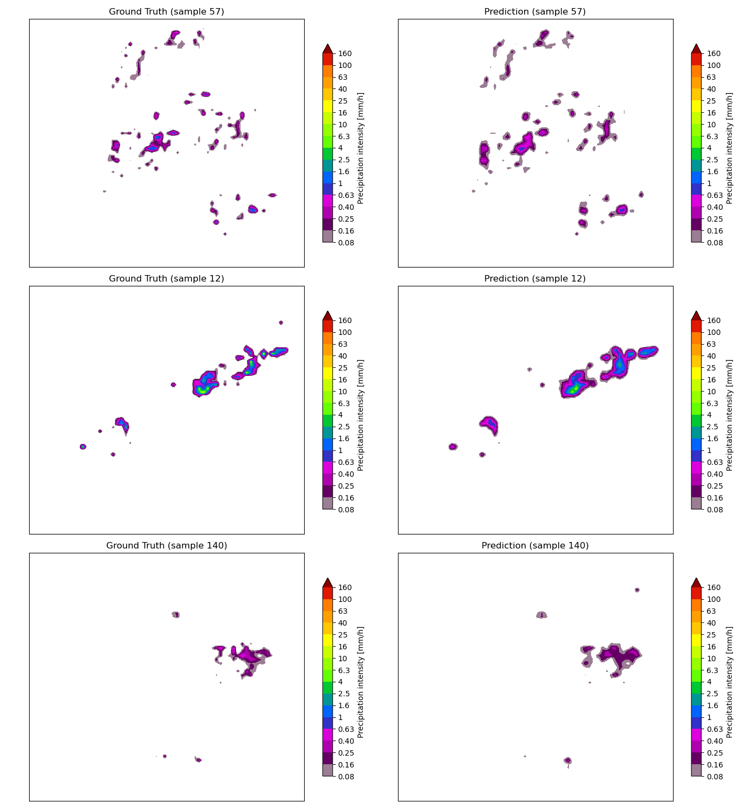

# Precipitation Nowcasting with MeteoSwiss Radar Data

[](https://pytorch.org)
[](https://pysteps.github.io)
[](https://streamlit.io)

**Deep Learning for short-term precipitation forecasting (0–30 min) using real MeteoSwiss RZC radar data.**

## 🎯 Project Status

| Milestone | Status | Description |
|-----------|--------|-------------|
| **1. Data Pipeline** | ✅ Complete | MCH RZC data → PyTorch Dataset with sliding-window sequences |
| **2. Visualization** | ✅ Complete | pysteps pyvis animations of radar sequences |
| **3. U-Net Training** | ✅ Complete | 2D U-Net (7-frame input → 1-frame prediction) with weighted MSE |
| **4. Streamlit Demo** | ✅ Complete | Interactive ground-truth vs. prediction comparison |
| **5. Multi-Step + CSI** | ⏳ Planned | 3/6-step predictions + weather metrics |
| **6. Baseline Comparison** | ⏳ Planned | vs. pysteps STEPS optical flow |

## 📂 Project Structure

```
├── app.py                        # Streamlit demo app
├── environment.yml               # Conda environment
├── pilot/
│   ├── get_data.py               # Download RZC HDF5 files from MeteoSwiss
│   ├── helper.py                 # Timestamp parsing utilities
│   ├── create_dataset.py         # PyTorch Dataset with dBR + min-max normalization
│   ├── data_exploration.py       # EDA and data validation
│   ├── proof_of_concepts.py      # Training loop and evaluation
│   ├── model/
│   │   └── u_net.py              # 2D U-Net architecture
│   └── data/                     # RZC radar HDF5 files (not tracked)
└── tests/
    └── test_model.py             # U-Net unit tests
```

## 🚀 Quick Start

```bash
# 1. Create environment
conda env create -f environment.yml
conda activate radar_nowcasting

# 2. Download radar data (example: 14 days)
python -c "
from pilot.get_data import download_mch_hdf5
import datetime as dt
date = dt.datetime.strptime('20260329', '%Y%m%d')
BASEURL = 'https://data.geo.admin.ch/ch.meteoschweiz.ogd-radar-precip'
for d in [date + dt.timedelta(days=x) for x in range(14)]:
    download_mch_hdf5('rzc', BASEURL, d, window=None)
"

# 3. Train the model (saves checkpoint to pilot/model/unet.pth)
python -m pilot.proof_of_concepts

# 4. Run Streamlit demo
streamlit run app.py
```

> **Note:** The model checkpoint (`unet.pth`) is not tracked in Git. You need to run the training script before launching the Streamlit app.

## 🧠 Approach

- **Input**: 7 consecutive radar frames (5-min interval, 35 min total), downscaled to 64×64
- **Output**: Next radar frame (t+5 min prediction)
- **Preprocessing**: dBR transform → min-max normalization; dry frames filtered out
- **Model**: 2D U-Net with early fusion (7 channels → 1 channel)
- **Loss**: Weighted MSE (10× weight on rain pixels vs. dry pixels)

## 📊 Proof of Concept

Ground truth (left) vs. U-Net prediction (right) on held-out test samples after 5 epochs of training on 14 days of RZC data:



The model captures the main precipitation structures and positions well. Current limitations:
- Smoothed predictions — fine-scale features and small scattered cells are lost
- 64×64 downsampling limits spatial detail (upscaled back to 640×710 for display)

